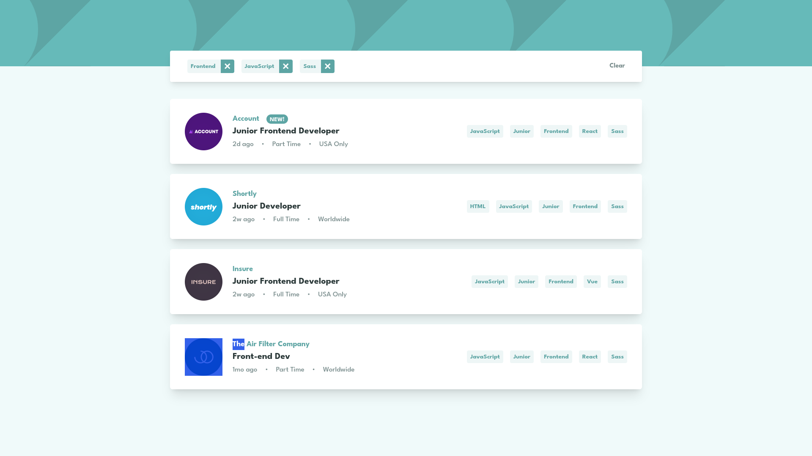
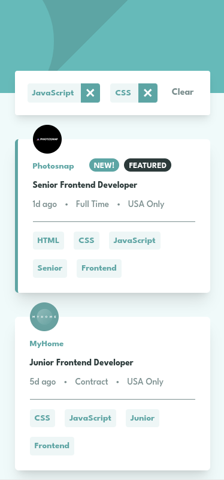

# Frontend Mentor - Job listings with filtering solution

This is a solution to the [Job listings with filtering challenge on Frontend Mentor](https://www.frontendmentor.io/challenges/job-listings-with-filtering-ivstIPCt). Frontend Mentor challenges help you improve your coding skills by building realistic projects. 

## Table of contents

- [Overview](#overview)
  - [The challenge](#the-challenge)
  - [Screenshot](#screenshot)
  - [Links](#links)
- [My process](#my-process)
  - [Built with](#built-with)
- [Author](#author)

## Overview

### The challenge

Users should be able to:

- View the optimal layout for the site depending on their device's screen size
- See hover states for all interactive elements on the page
- Filter job listings based on the categories

### Screenshot

### Links

- [Solution URL:](https://www.frontendmentor.io/solutions/job-listing-with-filtering-in-reactjs-QHZ-Qa98GP)
- [Live Site URL:](https://frontendmentor-static-job-listings-sooty.vercel.app/)

## My process

### Built with

- [ReactJS](https://reactjs.org/) - JS library
- [TailwindCSS](https://tailwindcss.com/) - For styles

## Author

- Frontend Mentor - [@bernard-rodrigues](https://www.frontendmentor.io/profile/bernard-rodrigues)
- LinkedIn - [@bernard-rodrigues](https://www.linkedin.com/in/bernard-rodrigues)